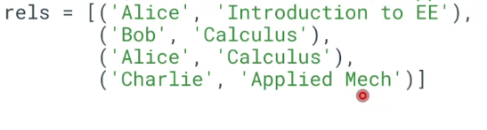

# Mechanisms for Persistent Storage and Relational Databases

**Summary**
**In-Memory Data Structures**

In-memory data structures are temporary data storage mechanisms that reside within the computer's main memory (RAM). They provide efficient and fast access to data during program execution but are volatile, meaning they are lost when the program terminates or the computer shuts down.

In-memory data structures are often used for temporary storage of data that is frequently accessed during program execution. They can take various forms, including:

* **Lists:** Ordered collections of elements that can be accessed and modified by their index. Example: `names = ['Alice', 'Bob', 'Charlie']`
* **Dictionaries:** Collections of key-value pairs, where each key is associated with a specific value. Example: `courses = {'Introduction to EE': 0, 'Applied Mech': 1, 'Calculus': 2}`
* **Sets:** Unordered collections of unique elements. Example: `students = {'Alice', 'Bob', 'Charlie'}`



**Limitations of In-Memory Data Structures**

* **Data Entry Errors:** In-memory data structures are prone to data entry errors due to manual input.
* **Limited Scalability:** They are not suitable for storing large amounts of data.
* **Duplicate Data:** In-memory data structures can contain duplicate entries.

**In-Memory Data Structures with Keys**

Using keys with in-memory data structures can address some of the limitations mentioned above:

* **Reduced Data Entry Errors:** Keys can help prevent data entry errors by ensuring that values are associated with unique identifiers.
* **Handling Duplicates:** Keys can ensure that duplicate values are not added to the data structure.

**Objects**

Objects are a more structured form of data storage in memory. They encapsulate data and behavior within a single unit, making it easier to manage and manipulate complex data. Objects can be defined using classes, which provide a blueprint for creating instances of the object.

For example, the following Python class defines a `Student` object:

```python
class Student:
    idnext = 0  # Class variable to generate unique IDs
  
    def __init__(self, name):
        self.name = name
        self.id = Student.idnext  # Assign unique ID
        Student.idnext += 1
```

Objects offer several advantages:

* **Auto-Initialization of Unique IDs:** Objects can automatically generate unique identifiers, ensuring that each object has a unique identity.
* **Encapsulation:** Objects bundle data and behavior together, making it easier to manage complex data.

**Persistence**

In-memory data structures are temporary and are lost when the program terminates. To store data persistently, it needs to be saved to a non-volatile storage medium, such as a disk or database.

Various methods can be used for data persistence:

* **Serialization:** Python's pickle module can be used to serialize objects into a binary format that can be saved to a file.
* **CSV (Comma-Separated Values)**: A simple text-based format for storing tabular data.
* **TSV (Tab-Separated Values)**: Similar to CSV but uses tabs as separators.

These methods essentially convert data into a format that can be stored on disk. However, they share limitations:

* **Limited Flexibility:** Data structures like spreadsheets can be inflexible, making it difficult to represent complex relationships.
* **Limited Functionality:** Spreadsheets offer limited capabilities for operations such as stored procedures and atomic operations.

**Relational Databases (SQL)**

Relational databases, such as SQL (Structured Query Language), provide a structured and efficient way to store and manage data. They organize data into tables, where each table consists of rows (representing individual records) and columns (representing fields).

SQL databases offer several advantages:

* **Tabular Format:** Data is stored in a tabular format, making it easy to represent relationships between different tables.
* **Data Integrity:** SQL databases enforce data integrity through constraints, ensuring the validity and consistency of data.
* **Queries and Stored Procedures:** SQL allows for complex queries to retrieve and manipulate data, and stored procedures provide a way to encapsulate complex operations.

**Unstructured Databases (NoSQL)**

NoSQL (Not Only SQL) databases are designed for handling large volumes of unstructured data that does not fit well into the structured format of relational databases.

NoSQL databases offer advantages such as:

* **Flexibility:** NoSQL databases allow for easy addition and modification of fields, making them suitable for rapidly evolving data structures.
* **Arbitrary Data:** They can store data in various formats, including JSON, XML, and binary objects.
* **Scalability:** NoSQL databases are designed to handle massive amounts of data, making them suitable for big data applications.

However, NoSQL databases may compromise on data integrity and consistency, which may not be suitable for all applications.
