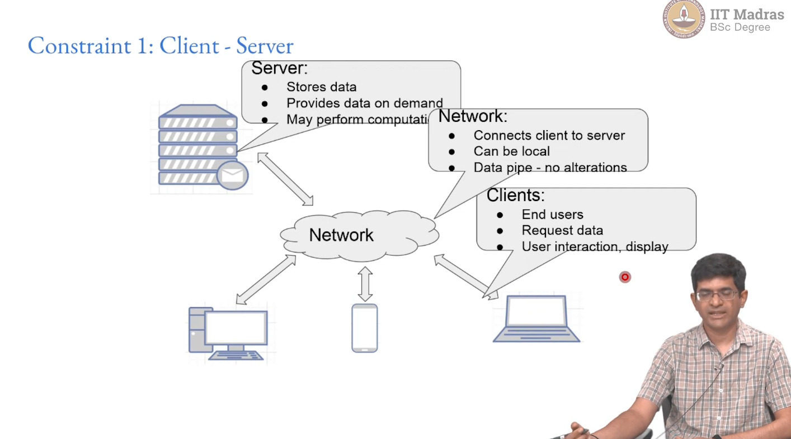

# Week 6

**Summary**

## REST and APIs

### API Design

- **Web architecture - REST:** REST (REpresentational State Transfer) is a software architecture style for distributed systems on the web. It defines a set of constraints that guide the design of web services.
- **API Examples:** APIs (Application Programming Interfaces) are interfaces that allow applications to communicate with each other. Examples of APIs include HTTP, HTTPS, SOAP, and REST.
- **OpenAPI specification:** The OpenAPI Specification (OAS) is a language-agnostic specification for describing REST APIs. It provides a common way to document and share APIs.

### Distributed Software Architecture

- **Servers - Clients:** In a distributed software architecture, clients and servers communicate with each other over a network.
- **Standard “protocols” needed for communication:** Protocols are sets of rules that govern how clients and servers communicate with each other. Some common protocols include HTTP, HTTPS, and SOAP.
- **Assumptions?** When designing a distributed software architecture, it is important to consider the following assumptions:
  - Is the server always on?
  - Does the server know what the client is doing?
  - Is client authentication required?
  - What is the network latency?

### The Web

- **Client - Server may be far apart:** Clients and servers on the web can be located far apart from each other.
- **Different networks, latencies, quality:** Clients and servers can be connected to different networks with different latencies and quality of service.
- **Authentication? Not core part of protocol:** Authentication is not a core part of the web protocol.
- **State?**
  - Servers do not know the state of the client.
  - Clients cannot be sure of the state of the server.

### Architecture for the Web

- **Roy Fielding, PhD thesis 2000 UC Irvine:** Roy Fielding's PhD thesis, "Architectural Styles and the Design of Network-based Software Architectures," introduced the concept of REST.
- **“REpresentational State Transfer” - REST:** REST is an architectural style that takes into account the limitations of the web and provides guidelines for designing web services.
- **Software Architecture Style:** REST is a software architecture style, not a set of rules.

### REST Constraints

**Constraint 1: Client - Server Network**

- **Clients:** End users who request data and display it.
- **Servers:** Store data and provide it on demand.
- **Network:** Connects clients to servers and transmits data.

**Constraint 2: Stateless**

- Servers cannot assume the state of the client.
- Clients cannot assume the state of the server.

**Constraint 3: Layered System**

- Networks, load balancers, proxy frontends, authentication servers, and backends are all components of a layered system.

**Constraint 4: Cacheability**

- Responses can be cached by proxy caches and browsers to improve performance.

**Constraint 5: Uniform Interface**

- Clients and servers interact in a uniform and predictable manner.
- Servers expose resources that can be discovered by clients.

**Constraint 6: Code on Demand (Optional)**

- Servers can extend client functionality by providing code (e.g., JavaScript, Java applets).
