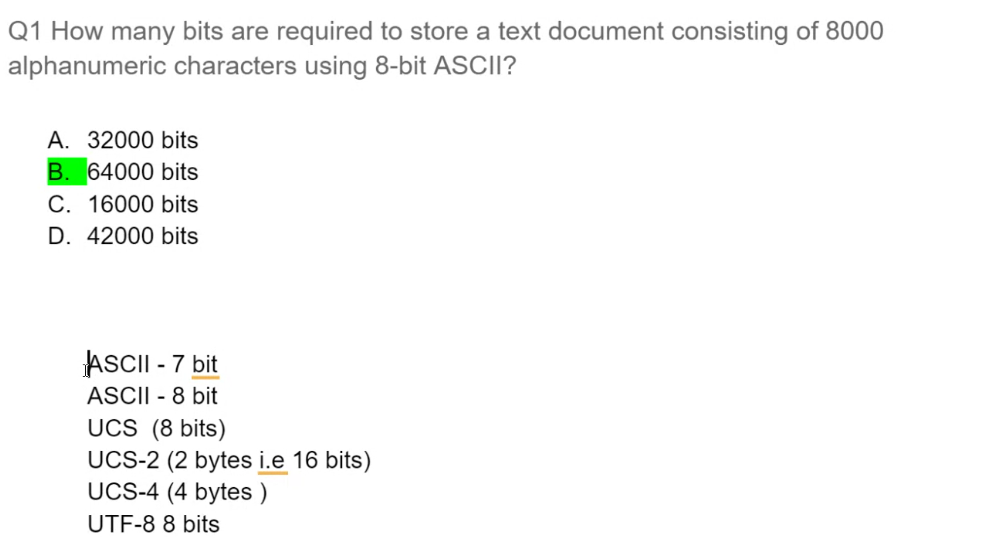
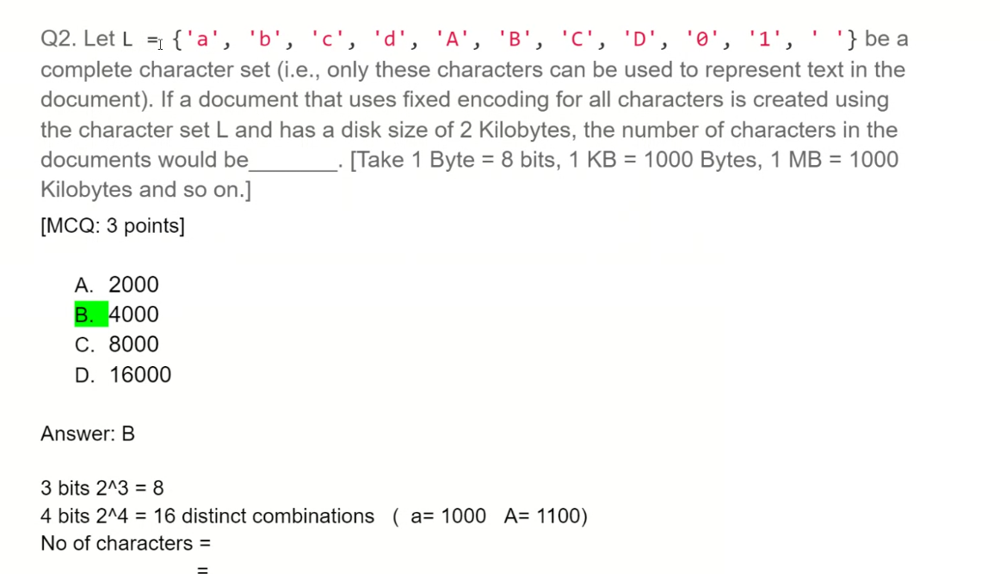

## Q1

if we are using 8 bit ASCII each character is represented by 8 bits .

doc has 8000 charcaters so  bits required is 8000* 8 bits = 64000 bits

## Q2

we have 11 character

$2^3$ = 3 bits = 8 combinations , we can represent 8 different characters

As we have 11 charater we will need $2^4$ = 4 bits = 16 character

1 character = 4 bits , so n characters storage size = n * 4 bits

no of characters = $\displaystyle\frac{size\ of\ file}{ bits\ per\ char}$ = $\displaystyle\frac{2*1000*8}{4}$= 4000

###### Styling Precident 

!important > inline > Internal > External

###### based styling Precident 

!important > ID > class > Element
