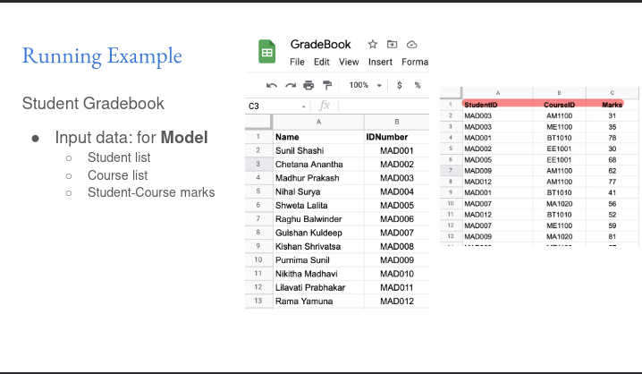
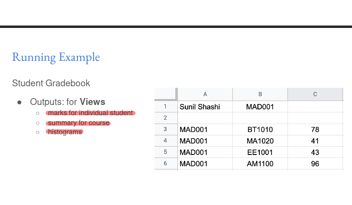
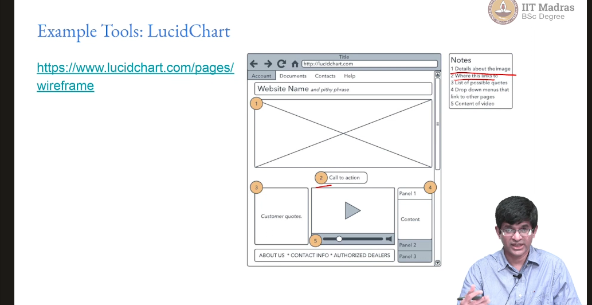

# Week 3

**Summary**
**MVC Paradigm**

The Model-View-Controller (MVC) paradigm is an architectural pattern commonly used in software development, including web application development. It separates the application into three distinct components:

1. **Model:**

   - Responsible for managing the application's data and business logic.
   - Stores and processes data, performing operations like saving, updating, and retrieving information.

   
2. **View:**

   - Responsible for presenting the data to the user.
   - Contains the user interface (UI) elements and interacts with the user through visual or auditory cues.

   
3. **Controller:**

   - Acts as a mediator between the model and the view.
   - Handles user input, updates the model accordingly, and triggers changes in the view.

The separation of these components allows for easier maintenance, adaptability, and code reuse.

**Origins and Foundations**

The MVC paradigm originated in the Smalltalk-80 programming language. It is rooted in the principles of object-oriented programming (OOP) and user interface development, where the separation of concerns is crucial for modularity and flexibility.

**View Design**

**User Interface Considerations:**

Views encompass the user interface (UI) of a web application, including:

- Screen displays
- Audio feedback
- Haptic feedback (vibrations)
- Motor controls (e.g., door opening mechanisms)

**User Interaction:**

User interaction with the view can vary depending on hardware constraints and target devices. Some common methods include:

- Keyboard and mouse inputs
- Touchscreens
- Spoken voice recognition
- Custom buttons

**Types of Views:**

Views can range in complexity from:

- **Fully static:** No dynamic content or interactivity. - Google
- **Partly dynamic:** Some elements change based on user input or data. - wiki
- **Mostly dynamic:** Majority of the content is dynamically generated and interactive.  - AMAZON.IN

**Output Formats:**

Views can generate output in various formats, such as:

- HTML (most commonly used for direct rendering)
- Dynamic images
- JSON/XML (machine-readable formats)

**User Interface Design Principles**

User interface design plays a significant role in the usability and user experience of a web application. Key principles include:

- **Simplicity:** Easy for users to understand and navigate.
- **Efficiency:** Users can achieve their goals with minimal effort.
- **Aesthetics:** Visually appealing and pleasing to the eye.
- **Accessibility:** Accessible to users with disabilities or impairments.

**Systematic Process**

User interface design involves a systematic process:

- **Functionality requirements gathering:** Determine the essential features and functions.
- **User and task analysis:** Understand user preferences and task requirements.
- **Prototyping:** Create wireframes and mockups to visualize the design.
- **Testing:** Conduct user acceptance, usability, and accessibility evaluations.

**Guidelines and Heuristics**

Jakob Nielsen's heuristics for user interface design provide valuable guidelines:

- Consistency
- Simple and minimal steps
- Simple language
- Minimal and aesthetically pleasing

### Understanding Jakob Nielsen’s 10 Usability Heuristics for User Interface Design

User experience is paramount in designing interfaces, and Jakob Nielsen’s 10 usability heuristics provide foundational principles for creating effective and intuitive user interfaces. These heuristics are broad guidelines that help ensure users have a seamless and enjoyable interaction with digital products.

#### 1. Visibility of System Status

Keeping users informed about what’s happening through timely feedback builds trust and reduces uncertainty.

#### 2. Match Between the System and the Real World

Using familiar language and conventions helps users understand and navigate interfaces more easily.

#### 3. User Control and Freedom

Providing ways to undo actions and exit processes gives users confidence and control over their interactions.

#### 4. Consistency and Standards

Maintaining consistency in design and following platform conventions makes learning easier for users.

#### 5. Error Prevention

Preventing errors by designing intuitive processes and providing confirmations can save users from frustration.

#### 6. Recognition Rather than Recall

Minimizing memory load by making options and information visible aids user recognition and efficiency.

#### 7. Flexibility and Efficiency of Use

Designing interfaces that accommodate both novice and experienced users through shortcuts and customization enhances usability.

#### 8. Aesthetic and Minimalist Design

Removing unnecessary elements focuses users on important information and tasks, improving usability.

#### 9. Help Users Recognize, Diagnose, and Recover from Errors

Clear, plain-language error messages with constructive solutions help users fix problems quickly.

#### 10. Help and Documentation

Providing accessible and task-focused help ensures users can find support when needed.

These heuristics are crucial for evaluating and improving user interfaces, ensuring they are user-friendly, efficient, and satisfying.

For a detailed exploration of each heuristic, visit [Nielsen Norman Group&#39;s article](https://www.nngroup.com/articles/ten-usability-heuristics/).

**Tools and Techniques**

Various tools and techniques aid in user interface design and implementation:

- **Wireframes:** Visual representations of the web page's structure and layout.

  
- **HTML generation:** Programmatic generation of HTML code using libraries like PyHTML.
- **Templates:** Reusable templates for generating standardized HTML content, such as Jinja2.

**Accessibility**

Accessibility ensures that users with disabilities or impairments can access and use a web application. It encompasses various principles:

- **Perceivable:** Provide alternatives for non-text content and make content easily discernible.
- **Operable:** Enable keyboard navigation, provide ample time for interaction, and avoid seizure-inducing content.
- **Understandable:** Use clear language, predictable behavior, and error correction mechanisms.
- **Robust:** Maintain compatibility with assistive technologies and future user tools.

**Aesthetic Considerations**

While accessibility is paramount, aesthetics also play a crucial role in user engagement and satisfaction. Simplicity, visual appeal, and consistency enhance the user experience. However, aesthetic preferences can vary over time as design trends evolve.
