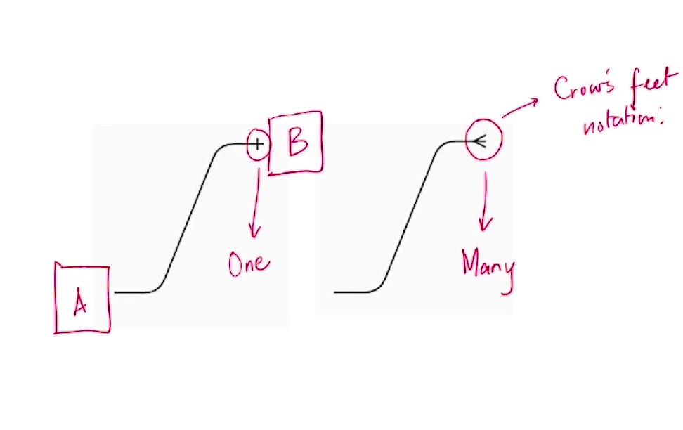
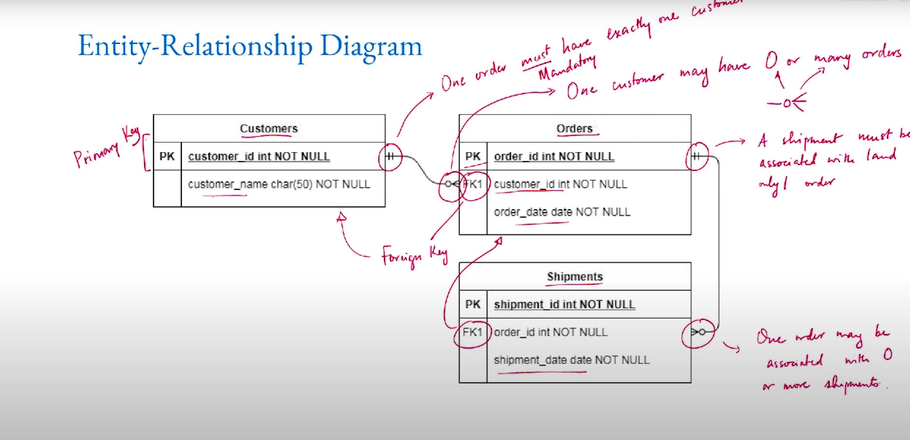
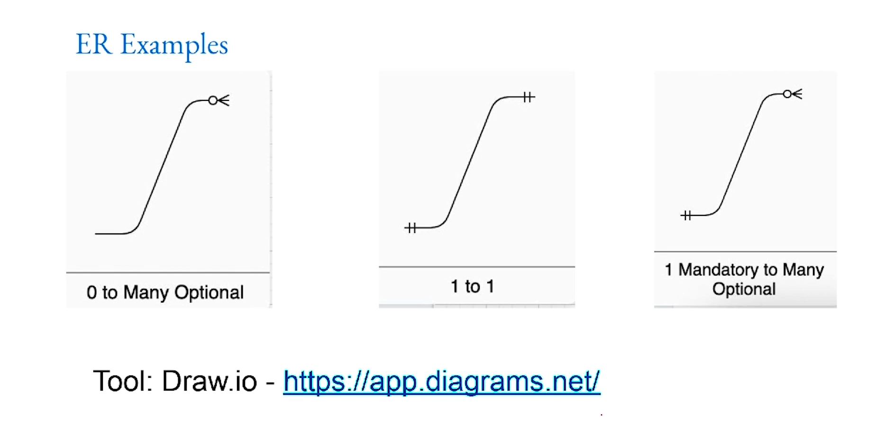

# Relations and ER Diagram

**Summary**
**Understanding Relationships in Data Modeling**

**Introduction**

In data modeling, relationships play a crucial role in defining the structure and organization of data. They establish connections between entities, allowing data to be linked and organized in a meaningful way. Understanding the different types of relationships and their representations is essential for designing effective data models.

**Types of Relationships**

There are three primary types of relationships in data modeling:

* **One-to-One:** A relationship where each entity in one set is associated with at most one entity in the other set. For example, a student can have only one roll number, and a roll number identifies only one student.
* **One-to-Many (Many-to-One):** A relationship where each entity in one set is associated with one or more entities in the other set, but each entity in the other set is associated with at most one entity in the first set. For example, a student can stay in only one hostel, while a hostel can have many students.
* **Many-to-Many:** A relationship where each entity in one set can be associated with one or more entities in the other set, and each entity in the other set can be associated with one or more entities in the first set. For example, a student can register for multiple courses, and a course can have multiple students.

**Diagrammatic Representations**

Relationships in data modeling are often represented using diagrams, such as Entity-Relationship (ER) diagrams and Unified Modeling Language (UML) diagrams.

**Entity-Relationship Diagrams (ERDs)**

ERDs are graphical representations that show the entities in a system, their attributes, and the relationships between them. Entities are represented by rectangles, attributes are represented by ovals, and relationships are represented by lines. The cardinality of a relationship (one-to-one, one-to-many, many-to-many) is indicated by symbols on the connecting lines.

**UML Diagrams**

UML diagrams use a more standardized notation to represent relationships. Class relationships are represented by lines with different types of arrowheads, where the type of arrowhead indicates the cardinality of the relationship.

**Additional Relationship Types**

In addition to the three primary types of relationships, there are several other variations, including:

* **Self-referential relationships:** Relationships where an entity can relate to itself. For example, a department can have a manager who is also an employee in the same department.
* **Weak entities:** Entities that require a relationship with another entity to exist. For example, a line item on an invoice cannot exist without an invoice.
* **Ternary relationships:** Relationships involving three entities. For example, a relationship between students, courses, and grades.

**Importance of Relationships in Data Modeling**

Relationships play a vital role in data modeling for several reasons:

* They define the structure and organization of data, enabling efficient data retrieval and manipulation.
* They ensure data consistency by maintaining constraints on the connections between entities.
* They facilitate data normalization, which reduces data redundancy and improves data integrity.
* They allow for the creation of complex data models that can accurately reflect real-world entities and their interactions.

**Conclusion**

Understanding relationships in data modeling is fundamental to designing effective and efficient data models. By comprehending the different types of relationships, their representations, and their importance, data architects and database designers can create data models that meet the requirements of their applications and provide a solid foundation for data-driven decisions.
